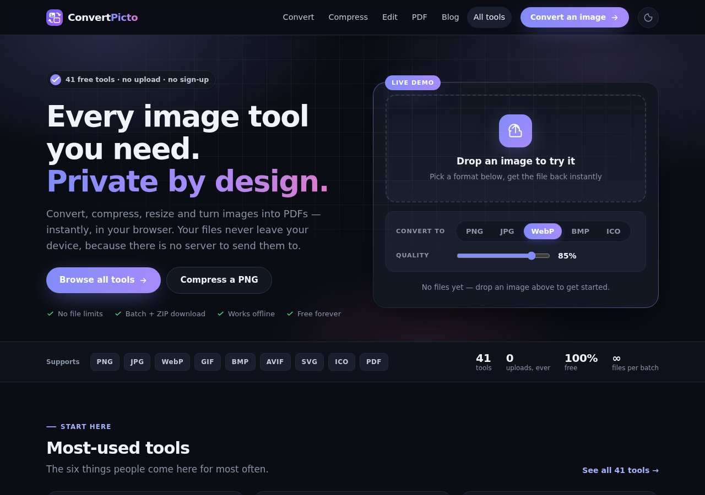

# ConvertPicto

**41 image tools that run entirely in your browser. No server, no upload, no dependencies.**

Live site: **[convertpicto.com](https://convertpicto.com)**

Every conversion, compression and edit happens on the visitor's own device using the Canvas API. There is no upload endpoint, because there is no server to receive one — load a page, disconnect from the internet, and the tools keep working.

This repository contains the whole thing: a static-site generator that turns one config file into 49 pages, and a single dependency-free JavaScript engine that powers every tool.



---

## Why this exists

Most online image converters upload your file to a server, process it there, and send it back. That's fine for a meme and less fine for a scan of your passport. It also means queues, file size limits, and a privacy policy you have to trust.

Browsers have been able to decode and re-encode images for years. For the common cases, the server is unnecessary.

The catch is that browsers only *encode* three formats — PNG, JPEG and WebP. Everything else in this project is written by hand in JavaScript.

## What's in it

**28 format conversions** across PNG, JPG, WebP, AVIF, GIF, BMP, SVG and ICO.

**Compression** for JPG, PNG and WebP — including real palette-based PNG optimisation, not just a re-save.

**Editing** — resize, rotate, flip, grayscale.

**PDF** — single images or many combined into one document.

**Developer tools** — a multi-size favicon generator and an image-to-Base64 data URI converter.

All of it batch-capable, with ZIP download, drag-and-drop, clipboard paste, and settings that re-process already-loaded files live.

---

## Architecture

Two pieces, both small.

```
build.py          964 lines   Static site generator (Python stdlib only)
src/engine.js     767 lines   The entire client-side tool engine
src/styles.css    381 lines   Design system, dark mode included
src/blog.py       212 lines   Markdown renderer, no dependencies
tests/            380 lines   Playwright suite that verifies real output bytes
```

### One engine, many tools

There is no per-tool JavaScript. Every tool page declares what it wants in a data attribute, and the shared engine reads it:

```html
<div id="tool" data-config='{"mode":"convert","from":"png","to":"jpg"}'></div>
```

`mode` is one of `convert`, `compress`, `resize`, `rotate`, `flip`, `grayscale`, `pdf` or `base64`. Adding a conversion is a line of config, not a new file.

### One generator, many pages

`build.py` holds the site config at the top — name, domain, contact details, analytics ID, ad slots — and every page is generated from it. Each tool definition produces a full page with an H1, benefit cards, a how-to, FAQs with `FAQPage` schema, related-tool links, breadcrumbs, canonical URL, Open Graph tags and a sitemap entry.

CSS and JavaScript are **inlined into every page**. No external stylesheets, no bundler, no build step beyond running the script. A page is one file that works when opened directly from disk.

---

## The interesting part: hand-written encoders

`canvas.toBlob()` gives you PNG, JPEG and WebP. Everything below is implemented from scratch in `src/engine.js`.

### Indexed PNG encoder

This is what makes the PNG compressor actually compress. A standard PNG stores 24-bit colour — 16 million possible values per pixel — when a logo might use twelve. The encoder:

1. Builds an optimised palette with **median-cut quantization**
2. Applies **Floyd–Steinberg dithering** to hide banding in gradients
3. Writes `IHDR`, `PLTE`, `tRNS`, `IDAT` and `IEND` chunks by hand
4. Computes **CRC32** for each chunk
5. Deflates the pixel data using the browser's native `CompressionStream`

Typical result on graphics and screenshots: 50–80% smaller, visually identical.

### PDF writer

Images are embedded as `DCTDecode` streams — the JPEG bytes are placed directly into the PDF without re-encoding — with a correctly built xref table and byte offsets. Page sizing supports A4, US Letter and fit-to-image, with configurable margins.

### ICO, BMP and ZIP

Multi-size ICO uses the PNG-in-ICO container format, so a single file carries 16×16 through 256×256. BMP is a 24-bit writer with the row padding and bottom-up scanline order the format requires. ZIP uses the store method with correct local headers and a central directory.

### The `toBlob` trap

Worth knowing if you're building anything similar. `canvas.toBlob()` does **not** reject unsupported MIME types — it silently falls back to PNG and hands you a blob that looks successful:

```javascript
function encodeCanvas(canvas, mime, quality) {
  return new Promise((resolve, reject) => {
    canvas.toBlob((blob) => {
      // A PNG labelled as AVIF is still a PNG. Verify.
      if (blob && blob.type === mime) resolve(blob);
      else reject(new Error("Your browser can't export this format"));
    }, mime, quality);
  });
}
```

Without that check you ship a converter that appears to work and silently produces the wrong format.

### SVG sizing

Browsers render an SVG with no explicit `width`/`height` at 300×150, regardless of its `viewBox`. The engine parses the viewBox, strips any existing dimensions, and injects explicit ones at 1024px wide before rasterising.

---

## Quick start

Requires Python 3.8+. No packages needed to build.

```bash
git clone https://github.com/shaam130/ConvertPicto.git
cd convertpicto
python3 build.py
```

Output lands in `dist/`. Open `dist/index.html` directly in a browser — it works from `file://`.

Pillow is optional; install it only if you want the social preview image and apple-touch icon generated:

```bash
pip install pillow
```

## Configuration

Everything is at the top of `build.py`:

```python
CLEAN_URLS = True
SITE = {
    "name": "ConvertPicto",
    "domain": "https://convertpicto.com",
    "contact_email": "you@example.com",
    ...
}
ADS = {"enabled": False, "placeholders": False, "client": "ca-pub-XXXXXXXXXXXXXXXX"}
ANALYTICS = {"ga4": ""}   # e.g. "G-XXXXXXXXXX"
```

Change the name and domain, run the build, and it's your site.

## Adding a conversion

In `build.py`, add a pair to `CONVERSIONS`:

```python
CONVERSIONS = [
    ("png", "jpg"),
    ("heic", "jpg"),   # new
]
```

The build generates the page, the SEO markup, the internal links and the sitemap entry. The engine needs no change as long as the browser can decode the input.

## Adding a blog post

Drop a Markdown file into `content/blog/`. See `content/blog/example-post.md` for the front matter fields and the two custom blocks — `:::tool slug|Label:::` renders an inline tool card, `:::note ...:::` a callout.

## Deploying

`dist/` is plain static files. Any host will do.

For Apache, the generated `.htaccess` handles clean URLs (`/png-to-jpg` rather than `/png-to-jpg.html`), 301 redirects from the `.html` versions, gzip, cache headers and security headers. Set `CLEAN_URLS = False` if your host doesn't support rewrites.

## Testing

```bash
pip install playwright pillow pypdf
playwright install chromium
python3 tests/test_site.py
```

The suite drives the real pages in headless Chromium and then verifies the **actual output bytes**: Pillow checks dimensions, colour modes and palette usage; pypdf checks page counts and sizes; Python's `zipfile` verifies archive integrity; Base64 output is round-tripped byte-for-byte. Rotation and flipping are compared against Pillow's own implementations.

It also checks every page's links resolve, JSON-LD parses, titles are unique, and heading levels don't skip.

---

## Limitations

Being honest about what a browser can't do:

- **No HEIC, RAW, PSD or TIFF decoding.** Browsers can't, and shipping a WASM decoder for each would outweigh the whole project. If you need these, a server-side tool is the right answer.
- **Large files depend on the device.** A 100-megapixel image on an old phone is slow, where a server would be instant.
- **AVIF encoding** is only available where the browser supports it. The engine detects this and reports it rather than silently producing a PNG.
- **Animated GIFs** convert their first frame only. Still-image formats can't hold animation.

## Browser support

Chrome, Edge, Firefox and Safari, current versions. `CompressionStream` is the newest API used — Chrome 80+, Firefox 113+, Safari 16.4+.

## License

MIT. See [LICENSE](LICENSE).

Built by [Ihtisham Khalil](https://ihtishamkhalil.com/).
